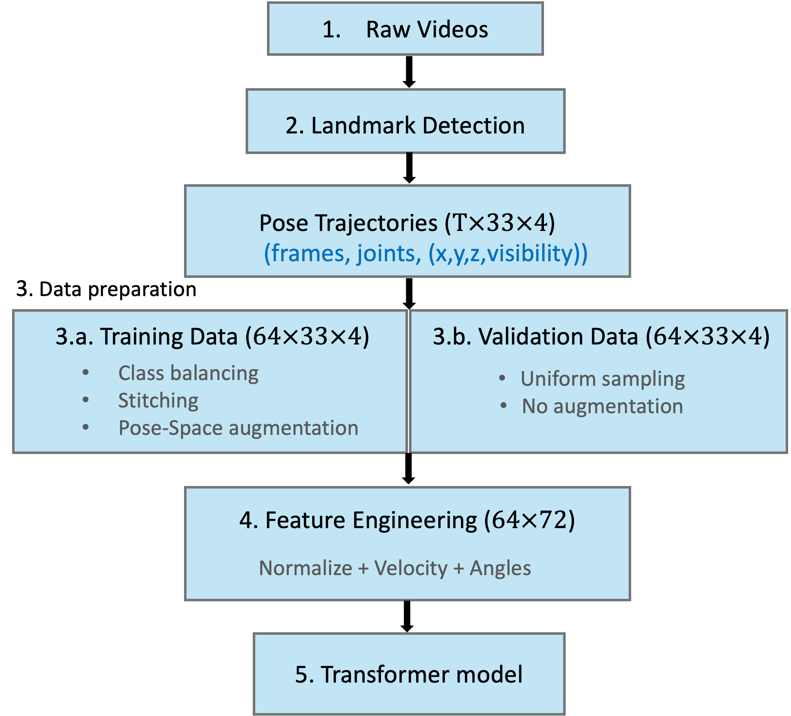

# Pose-Based Push-Up Repetition Counting

A machine vision coursework project that predicts the number of push-ups in a short video. The final pipeline extracts body landmarks with MediaPipe Pose, builds motion features, and uses a small Transformer encoder to classify counts from 1 to 10.

## Results

| Measure | Best reported validation result |
| --- | ---: |
| Exact count accuracy | **86.7%** (13 of 15 videos) |
| Within one repetition | **100%** |
| Mean absolute error | **0.133** repetitions |

These figures come from the final training run and its saved [diagnostics](figures/model_diagnostics.png). They describe one small coursework validation split, not an independent test set. The 15 validation videos contain counts 2–6 only, so performance on all 1–10 classes or new recording conditions remains unverified.


## Approach

1. **Pose extraction:** MediaPipe Pose produces 33 landmarks per frame, each with `x`, `y`, `z`, and visibility values.
2. **Data preparation:** The training notebook samples 64 frames per clip, balances count classes with temporal sampling and stitching, and applies pose-space augmentations. Validation clips use uniform sampling without augmentation.
3. **Features:** Centered joint coordinates, visibility, motion, and angles form a 72-dimensional feature vector per sampled frame.
4. **Prediction:** A 3-layer, 4-head Transformer with 128 hidden dimensions pools frame representations and predicts a count class.



The project also compared a YOLO11 Pose baseline, a DINOv2 video-feature baseline, and a regression head. The MediaPipe-based classification pipeline was selected for its more stable pose tracks and better results in this coursework setting.

The [dataset profile](figures/feature_dist.png) and [PCA projection](figures/pca_layer2.png) give more context for the class imbalance and learned representation.

## Repository contents

| Path | Contents |
| --- | --- |
| [`notebooks/train_pose_transformer.ipynb`](notebooks/train_pose_transformer.ipynb) | Pose extraction, data preparation, model training, and evaluation |
| [`notebooks/infer_pose_transformer.ipynb`](notebooks/infer_pose_transformer.ipynb) | Checkpoint loading and inference on video data |
| `figures/` | Selected pipeline, dataset, embedding, and training figures |

The notebooks are curated copies of the final coursework notebooks. Their code cells retain the original source; saved outputs, execution state, duplicate drafts, and assignment instructions were removed for this portfolio version. The source folder remains unchanged.

## Running the notebooks

The original workflow was developed in a notebook environment and expects the course-provided video data and network access for pretrained assets. A local environment can be started with:

```bash
python3 -m venv .venv
source .venv/bin/activate
python -m pip install -r requirements.txt
jupyter notebook
```

Open the training notebook and run its cells in order. Its data-download cell accesses the course's unsigned S3 bucket. The inference notebook retrieves the published [`model.pt` checkpoint](https://huggingface.co/zz-xu/mv-final-assignment/tree/main) from Hugging Face. The notebooks use relative paths and may need path adjustments outside the original Colab environment. Raw videos, pose caches, and model checkpoints are not stored in this repository.

## Limits

This is a compact count classifier, not a frame-by-frame repetition detector. The dataset is small and imbalanced, validation scores vary noticeably between epochs, and pose tracking degrades under occlusion. The reported validation result should be read in that context.
